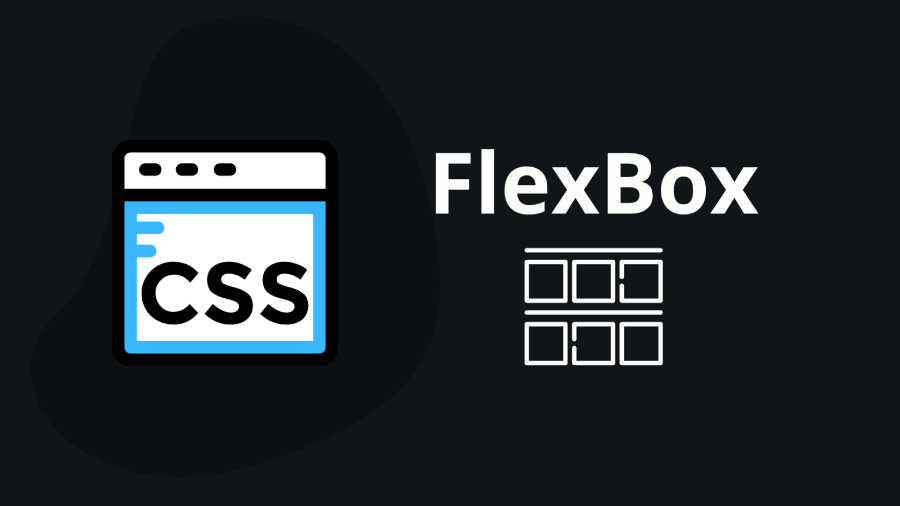

### Flexbox (short for Flexible Box Layout) is a CSS layout model that allows you to design complex layouts with a more efficient and predictable way than traditional CSS positioning and float methods. Flexbox properties are used to control the layout and alignment of elements within a flex container. Here is a list of the main flexbox properties:

###  1. `flex-direction`: Defines the direction in which the flex items are placed within the flex container. - Values: `row`, `row-reverse`, `column`, `column-reverse`

###  2. `flex-wrap`: Determines how flex items should wrap within the flex container when they exceed the container's width or height. - Values: `nowrap`, `wrap`, `wrap-reverse`

###  3. `flex-flow`: A shorthand property that combines `flex-direction` and `flex-wrap`. - Example: `flex-flow: row wrap;`

###  4. `justify-content`: Specifies how flex items are aligned along the main axis within the flex container. - Values: `flex-start`, `flex-end`, `center`, `space-between`, `space-around`, `space-evenly`

###  5. `align-items`: Controls how flex items are aligned along the cross axis within the flex container. - Values: `flex-start`, `flex-end`, `center`, `baseline`, `stretch`

###  6. `align-content`: Determines how multiple lines of flex items are aligned along the cross axis within the flex container. - Values: `flex-start`, `flex-end`, `center`, `space-between`, `space-around`, `stretch`

###  7. `order`: Specifies the order in which a flex item appears within the flex container. Lower values come first. - Example: `order: 2;`

###  8. `flex-grow`: Defines the ability of a flex item to grow relative to other flex items when there is extra space in the flex container. - Example: `flex-grow: 1;`

###  9. `flex-shrink`: Determines how a flex item should shrink when there isn't enough space in the flex container. - Example: `flex-shrink: 0;`

###  10. `flex-basis`: Specifies the initial size of a flex item before it grows or shrinks. - Example: `flex-basis: 100px;`

###  11. `flex`: A shorthand property that combines `flex-grow`, `flex-shrink`, and `flex-basis`. - Example: `flex: 1 0 auto;`

###  12. `align-self`: This property allows you to override the align-items value for a specific flex item. It determines how an individual item is aligned along the cross-axis. Possible values are the same as for align-items.

###  These flexbox properties allow you to create flexible and responsive layouts for web design, making it easier to handle various screen sizes and content arrangements.